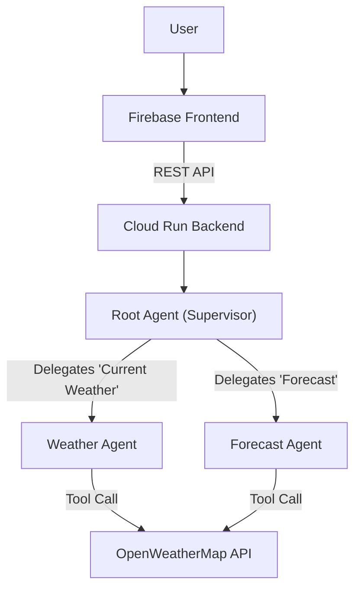

# 🌤️ Multi-Agent Weather Chatbot

A sophisticated, conversational weather assistant built with the **Google Agent Development Kit (ADK)** and **Vertex AI (Gemini 2.5 Flash)**. This project demonstrates a **Multi-Agent Architecture** where a supervisor agent intelligently delegates user queries to specialized sub-agents for current weather data and future forecasts.


## 🚀 Live Demo
**Try it here:** [https://lunar-prism-486120-n0.web.app](https://lunar-prism-486120-n0.web.app)

---

## 🏗️ Architecture

The system uses a hierarchical agent structure managed by the Google ADK `Runner`.



### Agents
1.  **Root Agent:** The entry point. It handles greetings, maintains conversation context, and decides whether to route the user to the Weather Agent or Forecast Agent based on natural language understanding.
2.  **Weather Agent:** Specialized in retrieving and summarizing real-time weather data.
3.  **Forecast Agent:** Specialized in retrieving 5-day forecasts and summarizing them into a readable 3-day outlook.

## ✨ Key Features

*   **Multi-Agent Orchestration:** Seamless handoffs between specialized agents using Google ADK.
*   **Google Vertex AI Integration:** Powered by the state-of-the-art **Gemini 2.5 Flash** model for high-speed reasoning and tool use.
*   **Robust Tooling:** Custom Python tools with automatic retry logic (`tenacity`) for reliable API interactions.
*   **Modern UI:** A beautiful, responsive glassmorphism interface built with HTML5/CSS3 and Vanilla JS.
*   **Session Persistence:** Maintains conversation history across page reloads using local storage and in-memory session management.
*   **Safety & Logging:** Implemented callbacks for pre- and post-model execution logging.

## 🛠️ Tech Stack

*   **Framework:** [Google Agent Development Kit (ADK)](https://github.com/google/adk)
*   **LLM:** Google Gemini 2.5 Flash (via Vertex AI)
*   **Backend:** Python 3.11, FastAPI, Uvicorn
*   **Frontend:** HTML, CSS, JavaScript (hosted on Firebase)
*   **Infrastructure:** Google Cloud Run (Containerized), Firebase Hosting
*   **External API:** OpenWeatherMap

## 📂 Project Structure

```
├── backend/
│   ├── agent.py        # Agent definitions (Root, Weather, Forecast)
│   ├── main.py         # FastAPI application & Runner setup
│   ├── tools.py        # OpenWeatherMap tool implementations
│   ├── callbacks.py    # Logging and safety callbacks
│   ├── auth.py         # API Key verification
│   └── requirements.txt
├── frontend/
│   ├── index.html      # Main UI
│   ├── style.css       # Modern styling
│   └── script.js       # Frontend logic & API integration
└── Dockerfile          # Container configuration
```

## 🚀 Getting Started

### Prerequisites
*   Google Cloud Project with Vertex AI enabled.
*   OpenWeatherMap API Key.
*   Python 3.11+

### Local Development

1.  **Clone the repository:**
    ```bash
    git clone https://github.com/yourusername/multi-agent-weather.git
    cd multi-agent-weather
    ```

2.  **Install Backend Dependencies:**
    ```bash
    cd backend
    pip install -r requirements.txt
    ```

3.  **Run the Backend:**
    ```bash
    uvicorn main:app --reload
    ```

4.  **Open Frontend:**
    Open `frontend/index.html` in your browser.

## ☁️ Deployment

*   **Backend:** Deployed to Google Cloud Run.
    ```bash
    gcloud run deploy weather-backend --source backend/
    ```
*   **Frontend:** Deployed to Firebase Hosting.
    ```bash
    firebase deploy --only hosting
    ```

## 👨‍💻 Author
**Divyanshu**  
*Built with ❤️ using Google Cloud AI.*